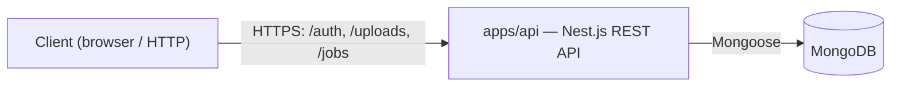

# Architecture Diagram Maintenance

This repo keeps three Mermaid diagrams under `docs/` (repo root, not
per-app), each with a different lifecycle:

- `docs/schema.mmd` — the data model, as a flowchart (not an erDiagram —
  deliberately matches the diagram type used by `docs/modules.mmd`).
  Auto-generated by `.claude/hooks/schema_diagram.js` from
  `@Schema()`/`@Prop()` decorators in `*.schema.ts` files anywhere under
  `apps/`. **Do not hand-edit this file** — it's regenerated by a
  PostToolUse hook every time a schema file changes.

- `docs/modules.mmd` — the Nest.js dependency-injection graph: controllers,
  services, gateways, and the models they touch, grouped by module. This
  one needs judgment (what counts as a meaningful relationship), so it is
  NOT auto-generated. Instead, a Stop hook flags when architecture-relevant
  files (`*.controller.ts`, `*.module.ts`, `*.service.ts`, `*.gateway.ts`,
  `main.ts`) changed during the turn, and this skill tells you how to
  reconcile it — once per turn, not once per edit. High churn — expect to
  touch this most turns that add or change a controller/service.

- `docs/architecture.mmd` — the system topology: deployable apps
  (`apps/api`, `apps/worker`, `apps/web`) and external services (MongoDB,
  Redis, R2) as boxes, with the real connections between them. Low churn —
  only update this when a new app or external service is actually wired
  in (a new app directory gets its first real code, a Redis/BullMQ client
  is added, an R2/S3 client is added), not for routine controller or
  service edits inside an existing app. Only diagram what's actually built
  and connected today — no placeholder boxes for planned-but-unbuilt
  pieces; track those in a source comment instead (see the file for the
  current list, sourced from `PIPELINE_DESIGN.md`).

## When the Stop hook fires

You'll see a message listing changed files — this is the trigger for
`docs/modules.mmd`, not `docs/architecture.mmd`. For each changed file:

1. **New `*.module.ts`** — add a node for the module; add edges for
   anything it imports/exports and any providers/controllers it registers.
   Note re-exported modules too (e.g. `AuthModule` re-exporting
   `PassportModule` so other feature modules can use `JwtAuthGuard`) — that
   relationship has caused real boot-time DI bugs in this project and is
   worth keeping visible.
2. **New/changed `*.controller.ts`** — add a node; edge from its owning
   module; edges to any services it injects via constructor.
3. **New/changed `*.service.ts`** — add a node; edges to any repositories/
   models (`@InjectModel`) or other services it depends on.
4. **New `*.gateway.ts`** (WebSocket gateways) — add a node; edge from its
   module, and note it as a distinct entry point (not just another service).
5. **`main.ts` changes** — usually just global middleware/pipe wiring;
   only touch the diagram if it changes which modules are bootstrapped.
6. **A new app directory gets its first real module/controller/service**
   (e.g. `apps/worker` stops being empty) — this is the one case where you
   should ALSO update `docs/architecture.mmd`: add a box for the new app
   and the real edges it has to other apps/services now that it exists.

Since `docs/modules.mmd` covers a monorepo, group top-level subgraphs by
app (`apps/api`, `apps/worker`, `apps/web`) and nest module subgraphs
inside the relevant app. Use a Mermaid `flowchart TD`, e.g.:

```mermaid
flowchart TD
    subgraph apps/api
        subgraph UsersModule
            UsersService --> UserModel[(User)]
        end
        subgraph AuthModule
            AuthController --> AuthService
            AuthService --> UsersService
            AuthModule -. re-exports .-> PassportModule
        end
    end
```

Keep it high-level: controllers, services, gateways, and the models they
touch. Don't diagram every method or DTO — that's what the code is for.

## Updating docs/architecture.mmd (system topology)

Use a flowchart of boxes (apps, MongoDB, Redis, R2) and labeled edges for
the real protocol/purpose of each connection, e.g.:



Add a box only once the thing it represents is real and connected — e.g.
don't add a Redis box until BullMQ/rate-limiting code actually connects to
Redis. Keep the "not yet built" list in the file's trailing `%%` comment
in sync with `PIPELINE_DESIGN.md` as pieces move from planned to built.

## Regenerating docs/schema.mmd manually

If you ever need to force a regeneration outside the hook (e.g. after
renaming several schema files at once):

```
node .claude/hooks/schema_diagram.js apps docs/schema.mmd
```

## Known limitations of the schema generator

It's a regex scan, not a full TS AST parse, so it will miss:
- Schemas built via helper functions instead of a plain `@Schema()` class
- Props whose type/ref span multiple lines in unusual ways
- Discriminators / schema inheritance beyond simple `extends`

For a practice project this is a fine trade-off (zero-dependency, instant,
no LLM cost). If you hit these limits, the fix is swapping the regex parser
for `ts-morph`, not adding LLM calls to the hot path.
