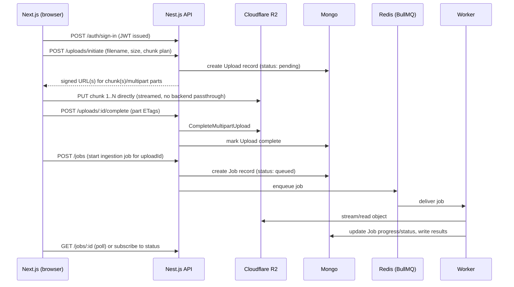

# Large File Ingestion Pipeline — Design

## Goals

- Frontend (Next.js) chunks and streams large files directly to object storage (R2), never through the backend.
- Backend (Nest.js) issues signed URLs, tracks jobs, and orchestrates processing via a decoupled worker pipeline.
- MongoDB is the system of record for users, uploads, and jobs.
- BullMQ + Redis is the message broker between services/stages.
- Redis also backs rate limiting.
- JWT-based auth (sign up / sign in), access-token-only for now.
- Each piece below is meant to be built and tested independently, in order.

## Decisions

| Question | Decision |
|---|---|
| Repo layout | Monorepo |
| Storage backend | **R2 first** — S3-compatible SDK (`@aws-sdk/client-s3` works against R2's endpoint), so switching to real S3 later is a config/credential change, not a rewrite |
| Auth tokens | **Access-token-only** for now (see below for the refresh-token upgrade path) |
| Ingestion processing | Not decided yet — worker built generic/pluggable so the real parse/transform/load logic can be swapped in later |
| Job status delivery | **Polling first** (`GET /jobs/:id`) — migrate to WebSocket/SSE push later once polling proves the job/queue plumbing works |

## Repo layout

```
apps/
  web/        # Next.js frontend
  api/        # Nest.js backend (HTTP API: auth, signed URLs, job control)
  worker/     # Nest.js standalone worker process(es) consuming BullMQ queues
packages/
  shared/     # Shared TS types/DTOs: JWT payload, job status enum, upload/job contracts
```

`api` and `worker` are separate deployable processes from the start, even though they live in one repo — this is what makes the pipeline "decoupled" rather than just modular. They communicate only through Mongo (state) and BullMQ (events), never by direct import of runtime code (only `packages/shared` types).

## High-level flow



Key principle: **the backend is never in the data path for the upload.** It only ever hands out signed URLs and metadata. The heavy bytes go browser → object storage directly, and later object storage → worker directly.

## Services (decoupled)

1. **Auth service** (`apps/api`) — sign up, sign in, JWT issuance/verification, guards.
2. **Upload/signing service** (`apps/api`) — computes chunk/part plan, generates presigned R2 PUT URLs, tracks upload lifecycle in Mongo, handles multipart completion.
3. **Job orchestration service** (`apps/api`) — validates an upload is complete, creates a Job document, enqueues it onto BullMQ, exposes job status/progress endpoints.
4. **Worker** (`apps/worker`) — separate process, consumes BullMQ queue(s), pulls the object from R2, does the actual ingestion work, writes progress/results back to Mongo, can enqueue follow-on jobs (multi-stage pipeline) rather than doing everything in one consumer.
5. **Rate limiting** (`apps/api`) — Redis-backed, applied at the API layer (per-user and/or per-IP), independent of the queue's Redis usage (same Redis instance is fine, separate logical concerns/key namespace).

Because stage 4 can itself be N queues (e.g. `validate` → `transform` → `load`), the "pipeline" is really a chain of BullMQ queues, each independently scalable/deployable, each only reading/writing Mongo + the next queue.

## Data model (MongoDB)

- **User**: `_id, email, passwordHash, createdAt`
- **Upload**: `_id, userId, key (R2 object key), filename, size, mimeType, status (pending|uploading|completed|failed), multipartUploadId?, parts: [{partNumber, etag}], createdAt, completedAt`
- **Job**: `_id, uploadId, userId, status (queued|running|completed|failed), stage, progress, error?, result?, createdAt, updatedAt`
- Optionally **JobEvent** (append-only log) if you want per-stage audit history rather than overwriting `Job.stage`.

## Auth (JWT, access-token-only)

- Endpoints: `POST /auth/sign-up`, `POST /auth/sign-in`, guarded routes via `@nestjs/passport` + `passport-jwt`.
- Passwords hashed with bcrypt/argon2.
- Single JWT (e.g. `userId`, `email`, `exp`) returned on sign-in/sign-up, sent as `Authorization: Bearer <token>`.
- Lifetime needs to cover a full session (e.g. 1–7 days) since there's no renewal — expiry just logs the user out.
- No real revocation/logout beyond client discarding the token (acceptable tradeoff for now).

### Future upgrade path: access + refresh tokens

If/when you add this: short-lived access token (~15m) + a longer-lived refresh token stored server-side (e.g. `RefreshToken` collection keyed by userId + hashed token) so individual sessions can be revoked. FE calls `/auth/refresh` silently when the access token expires. Adds a refresh endpoint, rotation-on-use logic, and a decision on where the refresh token lives client-side (httpOnly cookie is the safe default). This bolts on without changing the sign-up/sign-in contract much — just add a second token to the response.

## Upload flow detail

1. FE calls `POST /uploads/initiate` with filename/size/mimeType.
2. API decides chunking strategy (single presigned PUT for small files vs R2 multipart for large files — threshold TBD) and creates the Mongo `Upload` record.
3. API returns either one signed URL or a list of signed part URLs + an `uploadId` (R2 multipart concept, not to be confused with the Mongo Upload doc's `_id`).
4. FE streams each chunk directly to R2 with resumable/retryable logic (track which parts succeeded).
5. FE calls `POST /uploads/:id/complete` with the part ETags; API calls `CompleteMultipartUpload` and flips status.
6. Only after `Upload.status === completed` can `POST /jobs` be called for that upload — API should reject job creation otherwise.

## Rate limiting

- Redis-backed (e.g. `@nestjs/throttler` with a Redis storage adapter, or a custom sliding-window implementation).
- Applies to auth endpoints (brute-force protection) and upload-initiation endpoints (abuse/cost protection on signed URL issuance) at minimum.
- Uses the same Redis deployment as BullMQ but a distinct key namespace — no shared logical state with the queues.

## Suggested build order (independent, one-by-one)

1. **Auth** — sign up/sign in, JWT issuance, guards. No dependency on anything else.
2. **Mongo models + API skeleton** — Upload and Job schemas, empty CRUD.
3. **Signed URL issuance** — `/uploads/initiate` against R2, no real chunking yet, just prove a presigned PUT round-trips.
4. **Frontend chunked upload** — Next.js page that requests a signed URL and streams a file to it directly, with progress UI.
5. **Multipart / large-file chunking** — extend 3 & 4 to real multipart with resumability.
6. **Job creation + BullMQ wiring** — `/jobs` endpoint enqueues onto Redis; a minimal worker just logs and marks complete, to prove the queue plumbing before writing real processing logic.
7. **Real ingestion logic in the worker** — once you decide what "ingestion" means (parse/transform/load).
8. **Rate limiting** — bolt on last since it's orthogonal to correctness of the above.

## Job status delivery

Start with polling: FE calls `GET /jobs/:id` on an interval while `status` is `queued`/`running`. This is enough to validate the queue/worker plumbing end to end without adding a persistent-connection layer.

### Future upgrade path: WebSocket/SSE

Once polling works, swap the transport without changing the underlying state model: the worker already writes progress/status to Mongo on every update, so a WS gateway (`@nestjs/websockets`) or an SSE endpoint just needs to subscribe to those same updates (e.g. via a Mongo change stream, or by having the worker also publish to a Redis pub/sub channel the API relays to connected clients) and push them instead of waiting to be asked. `GET /jobs/:id` can stay as a fallback/initial-state fetch.

## Open questions

- **Ingestion processing**: what should the worker actually do to a file — parse/validate structure, transform/normalize, extract records into MongoDB, or something else? Worker will be built generic/pluggable in the meantime.
- **Chunk size / multipart threshold**: what file sizes are we actually designing for (hundreds of MB? multi-GB)? Affects whether single-PUT presigned URLs are sufficient or multipart is mandatory from step 1.
- **Deployment target**: does `apps/worker` need to scale independently (separate container/process count) from day one, or is a single worker instance fine for now?
